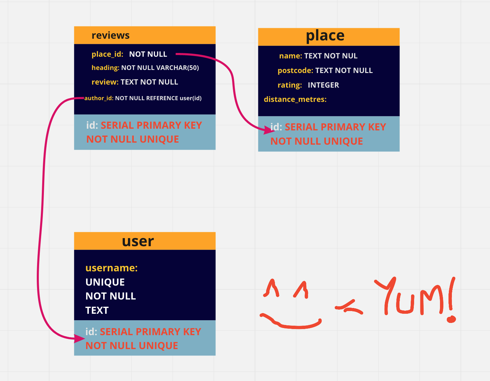

# week2-ABES

PostgreSQL Database project

## User Stories 📖

- As someone who has been to a restaurant/cafe/generic food outlet near SPACE4, I want to: submit a review/recommendation of the place I have visited. Information I want to submit:
  - Restaurant name
  - Restaurant address
  - distance/walking time from SPACE4
  - short heading
  - name of reviewer/username
  - the review
- As someone looking for somewhere to eat/grab a coffee near SPACE4, I want to: visit the site and see recommendations written by others (and myself) for places nearby

### Bonus 🏅

- As someone who knows what sort of thing they want, I want to: be able to filter the recommendations based on distance/number of "likes"
- As someone who likes a tidy interface, I want to: be able to see recommendations grouped by restaurant
- As someone who doesn't have enough time to leave a full review but wants to support a place I like, I want to: be able to just click a button to show my support to that place

### Schema 🗃

